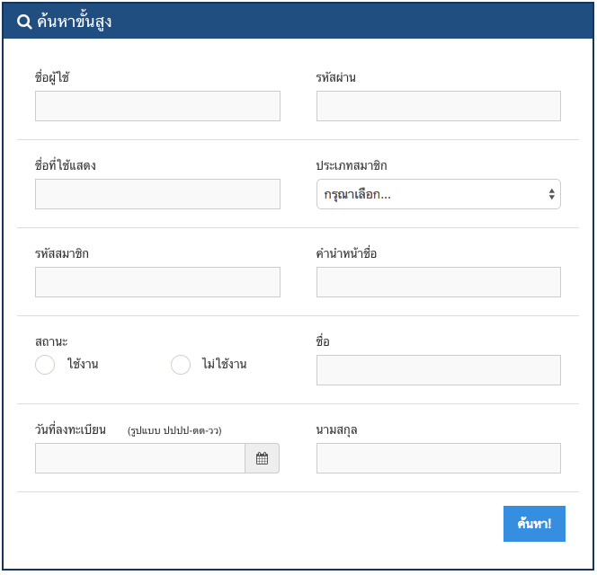

# การใช้งานทั่วไป

## การเข้าสู่ระบบ  
1. คลิกที่ปุ่มขวาบนของหน้าจอ บุคคลทั่วไป เลือกเมนูเข้าสู่ระบบ  
    

2. กรอก Username และ Password ตามลำดับ จากนั้นกดปุ่ม เข้าสู่ระบบ  
    

##การเปลี่ยนภาษา
คลิกที่รูปธงชาติ เลือกภาษาตามที่ต้องการ เมนูต่างๆของระบบห้องสมุดก็จะเปลี่ยนไปตามภาษาที่เลือก ในระบบจะมีเมนูสองภาษาดังนี้ 

3. หากต้องการให้ระบบจดจำข้อมูลการเข้าสู่ระบบ เพื่อสะดวกและรวดเร็วต่อการเข้าสู่ระบบให้ครั้งต่อไป ให้เลือกที่ช่อง จำฉันไว้  

## การออกจากระบบ
คลิกที่ปุ่มขวาบนของหน้าจอ บุคคลทั่วไป เลือกเมนูออกจากระบบ  
  

## การเปลี่ยนภาษา  

##การแก้ไขข้อมูลส่วนตัว
คลิกที่ปุ่มขวาบนของหน้าจอ บุคคลทั่วไป เลือกเมนูแก้ไขข้อมูลส่วนตัว จากนั้นสามารถแก้ไขข้อมูลต่างๆได้ตามต้องการ 

คลิกที่รูปธงชาติ เลือกภาษาตามที่ต้องการ เมนูต่างๆของระบบห้องสมุดก็จะเปลี่ยนไปตามภาษาที่เลือก ในระบบจะมีเมนูสองภาษาดังนี้  
1. ภาษาไทย  
2. ภาษาอังกฤษ  

## การแก้ไขข้อมูลส่วนตัว
คลิกที่ปุ่มขวาบนของหน้าจอ บุคคลทั่วไป เลือกเมนูแก้ไขข้อมูลส่วนตัว จากนั้นสามารถแก้ไขข้อมูลต่างๆได้ตามต้องการ 

โดยข้อมูลจะมีฟอร์มอยู่ 2 กลุ่ม คือบัญชี และข้อมูล 

โดยกลุ่มข้อมูลบัญชี จะต้องกรอกข้อมูลให้ครบทุกช่อง เมื่อแก้ไขข้อมูลส่วนตัวเสร็จแล้ว ก็กดปุ่มบันทึกที่อยู่ทางขวาล่างของฟอร์ม หากต้องการยกเลิก ก็ให้กดปุ่มยกเลิกที่อยู่ข้างๆกัน
 
## การค้นหาขั้นต้น
  

เป็นการค้นหาโดยใช้คำค้นอะไรก็ได้ ระบบจะนำคำค้นที่ระบุ ไปค้นหาข้อมูลให้อัตโนมัติ จากนั้นกดปุ่ม  ระบบจะแสดงผลลัพธ์การค้นหา

## การค้นหาขั้นสูง
การค้นหาขั้นสูงจะสามารถระบุข้อมูลที่ต้องการค้นหาได้โดยตรงผ่านแบบฟอร์ม  
  

##การค้นหาขั้นสูง
การค้นหาขั้นสูงจะสามารถระบุข้อมูลที่ต้องการค้นหาได้โดยตรงผ่านแบบฟอร์ม

##การดูข้อมูลตาราง

 
 
 สามารถเรียกดูข้อมูลในหน้าต่างๆได้จากเครื่องมือการนำทาง อยู่ที่มุมขวาล่างของตาราง
