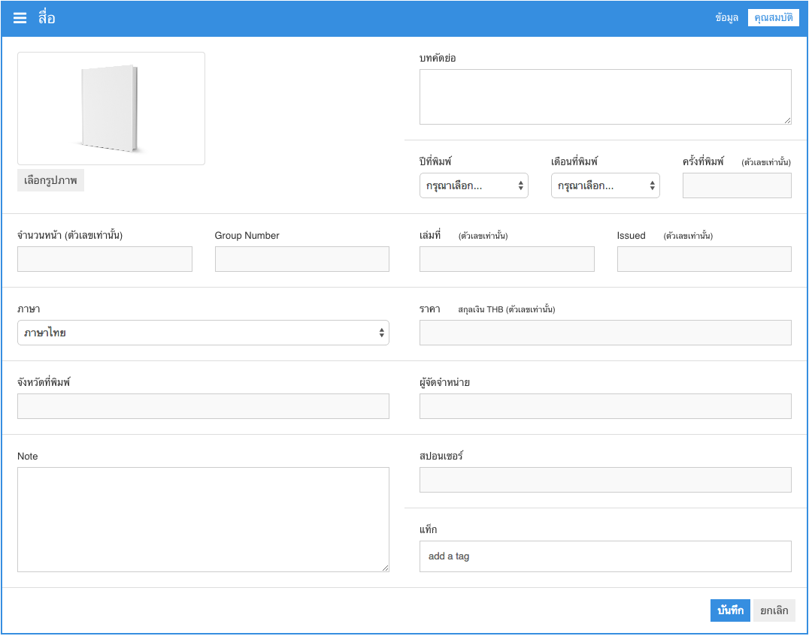
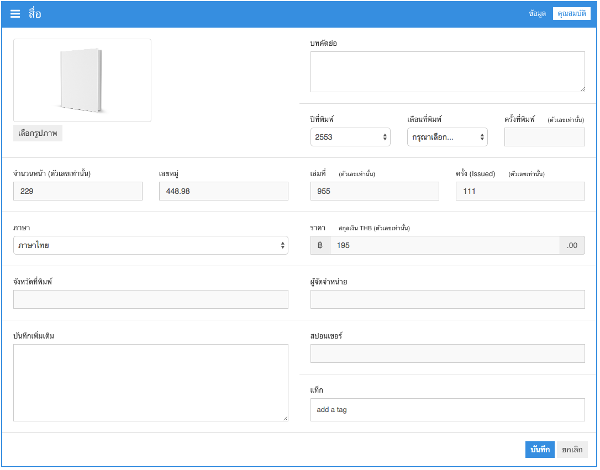
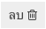

# สื่อ
สื่อในระบบ Super Library จะแบ่งออกเป็น 3 ประเภทคือ

1. สื่อที่เป็นหนังสือ
2. สื่อที่เป็นมีเดีย
3. สื่อที่เป็นนิตยสาร

ซึ่งสื่อทั้ง 3 ประเภทจะมีข้อมูลเหมือนกัน แต่จะแตกต่างกันที่รายละเอียดคุณสมบัติเท่านั้น

## รายชื่อสื่อ
  

### รายชื่อสื่อทั้งหมด
รายชื่อสื่อทั้งหมดจะเป็นข้อมูลสื่อ`ทั้งหมด` จำนวน 30 รายการล่าสุดที่สร้างขึ้นมาในระบบ โดยจะแสดงข้อมูลพื้นฐานที่จำเป็นของสื่อ ได้แก่ ชื่อสื่อ, ผู้แต่ง, สำนักพิมพ์, ISBN/ISSN, ปีที่ออก, หมวด, สถานะ, ตัวเลือก

|รายการ       | รายละเอียด|
|------------ | -------------|
|ชื่อสื่อ | ชื่อหนังสือ ชื่อนิตยสาร ชื่อมีเดีย|
|ผู้แต่ง | ชื่อผู้แต่ง|
|สำนักพิมพ์ | ชื่อสำนักพิมพ์|
|ISBN/ISSN | หมายเลข ISBN หรือ ISSN|
|ปีที่ออก | ปี พ.ศ. ที่ออกสื่อนี้|
|หมวด | หมวดของสื่อ|
|สถานะ | สถานะของสื่อ|
|ตัวเลือก       | ตัวเลือกในการจัดการข้อมูลของสื่อ (ดู, แก้ใข, ลบ)|

โดยสามารถเรียกดูข้อมูลในหน้าถัดไปได้จากเครื่องมือการนำทางหน้าที่มุมขวาล่าง 

### หนังสือ
เป็นข้อมูลรายชื่อสื่อ ที่กรองแต่สื่อประเภท`หนังสือ`เท่านั้น

### มีเดีย
เป็นข้อมูลรายชื่อสื่อ ที่กรองแต่สื่อประเภท`มีเดีย`เท่านั้น

### นิตยสาร
เป็นข้อมูลรายชื่อสื่อ ที่กรองแต่สื่อประเภท`นิตยสาร`เท่านั้น

##การค้นหาข้อมูลสื่อ
การค้นหาข้อมูลสื่อจะแบ่งออกเป็น การค้นหาขั้นต้น และการค้นหาขั้นสูง

### การค้นหาขั้นต้น
  
เป็นการค้นหาโดยใช้คำค้นอะไรก็ได้ ระบบจะนำคำค้นที่ระบุ ไปค้นหาข้อมูลให้อัตโนมัติ เช่น ใช้คำค้นว่า `นิทาน` จากนั้นกดปุ่ม  ระบบจะแสดงผลลัพธ์การค้นหาดังภาพ  

### การค้นหาขั้นสูง
  
การค้นหาขั้นสูงจะสามารถระบุข้อมูลที่ต้องการค้นหาได้โดยตรงผ่านแบบฟอร์ม

## เพิ่มข้อมูลสื่อ
สามารถทำได้โดยคลิกที่ปุ่ม  ระบบจะแสดงหน้าจอสำหรับรับข้อมูลสื่อใหม่ ซึ่งจะประกอบไปด้วย 2 Tab คือ **Tab "ข้อมูล"** และ **Tab "คุณสมบัติ"** ดังภาพ  
  
  

ส่วนประกอบรายการต่างๆ ของ **Tab "ข้อมูล"** `จำเป็น`ต้องกรอกให้ครบ

|รายการ       | รายละเอียด|
|------------ | -------------|
|ชื่อสื่อ | ชื่อหนังสือ ชื่อนิตยสาร ชื่อมีเดีย|
|ผู้แต่ง | ชื่อผู้แต่ง|
|ISBN/ISSN | หมายเลข ISBN หรือ ISSN|
|ประเภท| ประเภาของสื่อ|
|กลุ่ม| ชื่อกลุ่มของสื่อ|
|จำนวนสื่อ | จำนวนของสื่อที่มี|
|สถานะ| ใช้งาน, ไม่ใช้งาน|
|สำนักพิมพ์ | ชื่อสำนักพิมพ์|
|รหัสผู้แต่ง | รหัสผู้แต่ง|
|ปีที่ออก | ปีที่ออกสื่อชิ้นนี้|
|หมวด | ชื่อหมวด|
|หมวดย่อย | ชื่อหมวดย่อย|
|วันที่นำเข้า | วันที่ ที่นำสื่อเข้าระบบ (รูปแบบ ปปปป-ดด-วว)|

ส่วนประกอบรายการต่างๆ ของ **Tab "คุณสมบัติ"** `ไม่จำเป็น`ต้องกรอกให้ครบ ข้อมูลไหนไม่ทราบ ให้เว้นว่างไว้

|รายการ       | รายละเอียด|
|------------ | -------------|
|รูปภาพ | รูปภาพปกหนังสือ หรือสื่ออื่นๆ|
|จำนวนหน้า | จำนวนหน้า (ตัวเลขเท่านั้น)|
|เลขหมู่ | เลขหมู่หนังสือ|
|ภาษา | ภาษาที่ใช้ในสื่อ|
|จังหวัดที่พิมพ์ | จังหวัดที่จัดพิมพ์ |
|บันทึกเพิ่มเติม | สำหรับบันทึกข้อมูลเพิ่มเติม|
|บทคัดย่อ | เนื้อหาโดยย่อ|
|ปีที่พิมพ์ | ปี พ.ศ. ที่ออกสื่อ|
|เดือนที่พิมพ์ | เดือนที่ออกสื่อ|
|ครั้งที่พิมพ์ | จำนวนครั้งที่พิมพ์ (ตัวเลขเท่านั้น) |
|เล่มที่ | หมายเลขเล่ม (ตัวเลขเท่านั้น)|
|ครั้งที่ | หมายเลขครั้ง (ตัวเลขเท่านั้น)|
|ราคา | สกุลเงิน THB (ตัวเลขเท่านั้น) |
|ผู้จัดจำหน่าย | ชื่อผู้จัดจำหน่าย |
|สปอนเซอร์ | ชื่อสปอนเซอร์ |
|แท็ก| แท็กสำหรับใช้ในการสืบค้น|

เมื่อทำการกรอกข้อมูลเรียบร้อยแล้ว สามารถกดปุ่ม  เพื่อทำการบันทึกข้อมูลสื่อ หากบันทึกสำเร็จ จะมีข้อความแจ้งว่า `"สื่อถูกสร้างเสร็จเรียบร้อยแล้ว"`  
  

หากบันทึกไม่สำเร็จ จะมีข้อความแจ้งว่า ขาดข้อมูลอะไรไปบ้าง ให้กลับไปกรอกข้อมูลให้ครบถ้วน และกดปุ่มบันทึกอีกครั้ง

## เรียกดูข้อมูลสื่อ
สามารถทำได้โดยคลิกที่ไอคอน  ในส่วนของตัวเลือกในหน้าจอรายชื่อสื่อ เมื่อคลิกเข้ามา ระบบจะแสดงข้อมูลรายละเอียดทั้งหมด ของสื่อนั้นๆ  
  

## แก้ใขข้อมูลสื่อ
สามารถทำได้โดยคลิกที่ไอคอน  ในส่วนของตัวเลือกในหน้าจอรายชื่อสื่อ หรือคลิกที่ปุ่ม  ก็ได้ เมื่อคลิกเข้ามา ระบบจะแสดงแบบฟอร์มสำหรับแก้ใขข้อมูลของสื่อนั้นๆ ซึ่งจะประกอบไปด้วย 2 Tab คือ **Tab "ข้อมูล"** และ **Tab "คุณสมบัติ"** เช่นเดียวกับขั้นตอน การเพิ่มข้อมูลสื่อ  
  
  
ส่วนประกอบรายการต่างๆ ของ **Tab "ข้อมูล"** และ **Tab "คุณสมบัติ"** จะมีรายละเอียดเหมือนกันกับขั้นตอนการเพิ่มข้อมูล

เมื่อทำการกรอกข้อมูลเรียบร้อยแล้ว สามารถกดปุ่ม  เพื่อทำการบันทึกข้อมูลสื่อ หากบันทึกสำเร็จ จะมีข้อความแจ้งว่า `"ข้อมูลสื่อได้รับการปรับปรุงเรียบร้อยแล้ว"`  
  

หากบันทึกไม่สำเร็จ จะมีข้อความแจ้งว่า ขาดข้อมูลอะไรไปบ้าง ให้กลับไปกรอกข้อมูลให้ครบถ้วน และกดปุ่มบันทึกอีกครั้ง

## การลบข้อมูลสื่อ
การลบข้อมูลสื่อ จะเป็นการลบข้อมูลสื่อออกจากระบบ โดยไม่สามารถเรียกคืนข้อมูลได้ ผู้ใช้งานต้องระมัดระวังในจุดนี้ ซึ่งสามารถทำได้โดยคลิกที่ไอคอน  ในส่วนของตัวเลือกในหน้าจอรายชื่อสื่อ หรือคลิกที่ปุ่ม  ก็ได้ หลังจากคลิก ระบบจะแสดงหน้าต่างยืนยันการลบข้อมูล  
  
หากมั่นใจ และต้องการลบข้อมูลให้กดปุ่ม  ระบบจะทำการลบข้อมูลสื่อออกจากระบบ โดยไม่สามารถเรียกคืนข้อมูลได้อีก