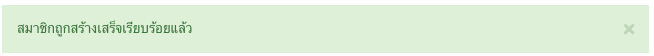
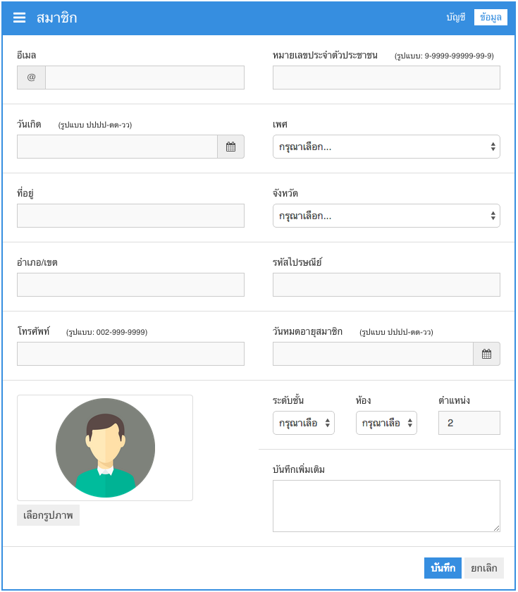

# สมาชิก
สมาชิกในระบบ Super Library จะแบ่งออกเป็น 3 ประเภทคือ

1. สมาชิกที่เป็นนักเรียน
2. สมาชิกที่เป็นอาจารย์/บุคลากร
3. สมาชิกที่เป็นผู้ดูแลระบบ

ซึ่งสมาชิกทั้ง 3 ประเภทจะมีข้อมูลเหมือนกัน แต่จะแตกต่างกันที่สิทธิ์ในการเข้าใช้งาน ใน Super Library เวอร์ชั่น 1.0 จะกำหนดสิทธิ์ให้กับสมาชิกแต่ละประเภท ดังนี้

1. สมาชิกที่เป็นนักเรียน
    - สามารถสืบค้น และเรียกดูข้อมูลสื่อในระบบได้  
    - สามารถเรียกดูประวัติการยืม-คืน ของตัวเองได้ (Super Library 2.0)  
    - สามารถทำรายการยืม/คืน ได้ด้วยตนเอง (Super Library 2.0)  
2. สมาชิกที่เป็นอาจารย์/บุคลากร
    - สามารถสืบค้น และเรียกดูข้อมูลสื่อในระบบได้  
    - สามารถเรียกดูประวัติการยืม-คืน ของตัวเองได้ (Super Library 2.0)  
    - สามารถทำรายการยืม/คืน ได้ด้วยตนเอง (Super Library 2.0)
3. สมาชิกที่เป็นผู้ดูแลระบบ
    - สามารถใช้งานได้ทุกส่วนของระบบ

## รายชื่อสมาชิก

### รายชื่อสมาชิกทั้งหมด
รายชื่อสมาชิกทั้งหมดจะเป็นข้อมูลสมาชิก`ทั้งหมด` จำนวน 30 คนล่าสุดที่สร้างขึ้นมาในระบบ โดยจะแสดงข้อมูลพื้นฐานที่จำเป็นของสมาชิก ได้แก่ รหัสสมาชิก, ชื่อสมาชิก, ประเภทของสมาชิก, สถานะ, วันที่ลงทะเบียน, ตัวเลือก

|รายการ       | รายละเอียด|
|------------ | -------------|
|รหัสสมาชิก     | รหัสสมาชิกใช้สำหรับเข้าสู่ระบบ|
|ชื่อสมาชิก      | ชื่อสมาชิกที่ใช้แสดงผลในระบบ|
|ประเภทของสมาชิก | นักเรียน, อาจารย์, ผู้ดูแลระบบ|
|สถานะ        | ใช้งาน, ไม่ใช้งาน|
|วันที่ลงทะเบียน  | วันเดือนปี ที่สมาชิกได้ลงทะเบียนไว้|
|ตัวเลือก       | ตัวเลือกในการจัดการข้อมูลของสมาชิก (ดู, แก้ใข, ลบ)|

โดยสามารถเรียกดูข้อมูลในหน้าถัดไปได้จากเครื่องมือการนำทางหน้าที่มุมขวาล่าง 

### นักเรียน
เป็นข้อมูลรายชื่อสมาชิก ที่กรองแต่สมาชิกประเภท`นักเรียน`เท่านั้น

### อาจารย์/บุคลากร
เป็นข้อมูลรายชื่อสมาชิก ที่กรองแต่สมาชิกประเภท`อาจารย์`เท่านั้น

## การค้นหาข้อมูลสมาชิก
การค้นหาข้อมูลสมาชิกจะแบ่งออกเป็น การค้นหาขั้นต้น และการค้นหาขั้นสูง

### การค้นหาขั้นต้น

เป็นการค้นหาโดยใช้คำค้นอะไรก็ได้ ระบบจะนำคำค้นที่ระบุ ไปค้นหาข้อมูลให้อัตโนมัติ เช่น ใช้คำค้นว่า `เอกราช` จากนั้นกดปุ่ม  ระบบจะแสดงผลลัพธ์การค้นหาดังภาพ

### การค้นหาขั้นสูง

การค้นหาขั้นสูงจะสามารถระบุข้อมูลที่ต้องการค้นหาได้โดยตรงผ่านแบบฟอร์ม

## เพิ่มข้อมูลสมาชิก
สามารถทำได้โดยคลิกที่ปุ่ม  ระบบจะแสดงหน้าจอสำหรับรับข้อมูลสมาชิกใหม่ ซึ่งจะประกอบไปด้วย 2 Tab คือ **Tab "บัญชี"** และ **Tab "ข้อมูล"** ดังภาพ  
  
  

ส่วนประกอบรายการต่างๆ ของ **Tab "บัญชี"** `จำเป็น`ต้องกรอกให้ครบ

|รายการ       | รายละเอียด|
|------------ | -------------|
|ชื่อผู้ใช้        | ชื่อผู้ใช้ในระบบ ใช้สำหรับ Login เข้าสู่ระบบ|
|ชื่อที่ใช้แสดง    | ชื่อที่ใช้แสดงผลในระบบ|
|รหัสสมาชิก     | รหัสสมาชิก|
|สถานะ        | ใช้งาน, ไม่ใช้งาน|
|วันที่ลงทะเบียน  | วันที่ที่ลงทะเบียน (รูปแบบ ปปปป-ดด-วว)|
|รหัสผ่าน       | รหัสผ่าน|
|ประเภทสมาชิก  | นักเรียน, อาจารย์, ผู้ดูแลระบบ|
|คำนำหน้าชื่อ    | คำนำหน้าชื่อ|
|ชื่อ           | ชื่อสมาชิก|
|นามสกุล       | นามสกุลสมาชิก|

ส่วนประกอบรายการต่างๆ ของ **Tab "ข้อมูล"** `ไม่จำเป็น`ต้องกรอกให้ครบ ข้อมูลไหนไม่ทราบ ให้เว้นว่างไว้

|รายการ       | รายละเอียด|
|------------ | -------------|
|อีเมล         | ที่อยู่อีเมล์ของสมาชิก|
|วันเกิด        | วัดเกิดสมาชิก|
|ที่อยู่          | ที่อยู่สมาชิก|
|อำเภอ/เขต    | อำเภอ/เขตของที่อยู่ของสมาชิก|
|โทรศัพท์       | หมายเลขโทรศัพท์ของสมาชิก (รูปแบบ: 002-999-9999)|
|รูปภาพ        | รูปภาพของสมาชิก|
|หมายเลขประจำตัวประชาชน | หมายเลขประจำตัวประชาชนของสมาชิก|
|เพศ          | เพศ ของสมาชิก|
|จังหวัด        | จังหวัดของที่อยู่ ของสมาชิก|
|รหัสไปรษณีย์    | รหัสไปรษณีย์ของที่อยู่ ของสมาชิก|
|วันหมดอายุสมาชิก| วันหมดอายุของสมาชิก (ถ้ามี)|
|ระดับชั้น ห้อง ตำแหน่ง  | ระดับชั้น ห้อง,ตำแหน่งของสมาชิก|
|บันทึกเพิ่มเติม   | สำหรับบันทึกข้อมูลเพิ่มเติม|

เมื่อทำการกรอกข้อมูลเรียบร้อยแล้ว สามารถกดปุ่ม  เพื่อทำการบันทึกข้อมูลสมาชิก หากบันทึกสำเร็จ จะมีข้อความแจ้งว่า `"สมาชิกถูกสร้างเสร็จเรียบร้อยแล้ว"`  

หากบันทึกไม่สำเร็จ จะมีข้อความแจ้งว่า ขาดข้อมูลอะไรไปบ้าง ให้กลับไปกรอกข้อมูลให้ครบถ้วน และกดปุ่มบันทึกอีกครั้ง

## เรียกดูข้อมูลสมาชิก
สามารถทำได้โดยคลิกที่ไอคอน  ในส่วนของตัวเลือกในหน้าจอรายชื่อสมาชิก เมื่อคลิกเข้ามา ระบบจะแสดงข้อมูลรายละเอียดทั้งหมด ของสมาชิกนั้นๆ  

## แก้ใขข้อมูลสมาชิก
สามารถทำได้โดยคลิกที่ไอคอน  ในส่วนของตัวเลือกในหน้าจอรายชื่อสมาชิก หรือคลิกที่ปุ่ม  ก็ได้ เมื่อคลิกเข้ามา ระบบจะแสดงแบบฟอร์มสำหรับแก้ใขข้อมูลของสมาชิกนั้นๆ ซึ่งจะประกอบไปด้วย 2 Tab คือ **Tab "บัญชี"** และ **Tab "ข้อมูล"** เช่นเดียวกับขั้นตอน การเพิ่มข้อมูลสมาชิก   
  
  
ส่วนประกอบรายการต่างๆ ของ **Tab "บัญชี"** และ **Tab "ข้อมูล"** จะมีรายละเอียดเหมือนกันกับขั้นตอนการเพิ่มข้อมูล

เมื่อทำการกรอกข้อมูลเรียบร้อยแล้ว สามารถกดปุ่ม  เพื่อทำการบันทึกข้อมูลสมาชิก หากบันทึกสำเร็จ จะมีข้อความแจ้งว่า `"ข้อมูลสมาชิกได้รับการปรับปรุงเรียบร้อยแล้ว"`  
  

หากบันทึกไม่สำเร็จ จะมีข้อความแจ้งว่า ขาดข้อมูลอะไรไปบ้าง ให้กลับไปกรอกข้อมูลให้ครบถ้วน และกดปุ่มบันทึกอีกครั้ง

## การลบข้อมูลสมาชิก
การลบข้อมูลสมาชิก จะเป็นการลบข้อมูลสมาชิกออกจากระบบ โดยไม่สามารถเรียกคืนข้อมูลได้ ผู้ใช้งานต้องระมัดระวังในจุดนี้ ซึ่งสามารถทำได้โดยคลิกที่ไอคอน  ในส่วนของตัวเลือกในหน้าจอรายชื่อสมาชิก หรือคลิกที่ปุ่ม  ก็ได้ หลังจากคลิก ระบบจะแสดงหน้าต่างยืนยันการลบข้อมูล  
  
หากมั่นใจ และต้องการลบข้อมูลให้กดปุ่ม  ระบบจะทำการลบข้อมูลสมาชิกออกจากระบบ โดยไม่สามารถเรียกคืนข้อมูลได้อีก