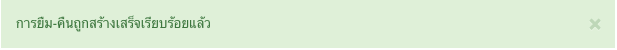
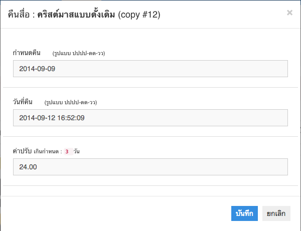

#การยืม-คืนสื่อ
การยืม-คืนสื่อในระบบ Super Library จะใช้หน้าจอเดียวกันทั้งหมด โดยสามารถทำได้ทั้งวิธีกรอกข้อมูลผ่าน Keyboard หรือ อ่าน Barcode จากเครื่องยิง Barcode

ซึ่งการยืม-คืนสื่อทุกประเภท จะใช้หน้าจอเดียวกัน แต่จะแตกต่างกันที่วิธี Input ข้อมูลเท่านั้น

##รายการยืม

###รายชื่อการยืมทั้งหมด
รายการยืมทั้งหมดจะเป็นข้อมูลการยืม`ทั้งหมด` จำนวน 30 รายการล่าสุดที่สร้างขึ้นมาในระบบ โดยจะแสดงข้อมูลพื้นฐานที่จำเป็นของการยืม ได้แก่ 
วันที่ยืม, รหัสสมาชิก, ชื่อสมาชิก, สื่อ, กำหนดคืน, สถานะ, วันที่คืน/วันที่เหลือ, ค่าปรับ, ตัวเลือก

รายการ       | รายละเอียด
------------ | -------------
วันที่ยืม  | วันที่ที่เกิดการยืม (รูปแบบ วัน เดือน ปี)
รหัสสมาชิก  | รหัสสมาชิกที่ยืม
ชื่อสมาชิก  | ชื่อของสมาชิกที่ยืม
สื่อ  | ชื่อของสื่อที่ยืม
กำหนดคืน  | วันที่ที่ต้องคืนสื่อ (รูปแบบ วัน เดือน ปี)
สถานะ  | สถานะของการยืม (คืนแล้ว, ยังไม่ได้คืน)
วันที่คืน/วันที่เหลือ  | วันที่ที่ได้รับคืน หรือวันที่เลยกำหนด (รูปแบบ วัน เดือน ปี)
ค่าปรับ  | ค่าปรับ กรณีคืนเกินกำหนด
ตัวเลือก       | ตัวเลือกในการจัดการข้อมูลของการยืม (ดู, แก้ใข)

โดยสามารถเรียกดูข้อมูลในหน้าถัดไปได้จากเครื่องมือการนำทางหน้าที่มุมขวาล่าง 

###วันที่คืน/วันที่เหลือ
ระบบจะแสดงช่วงเวลาที่เกี่ยวข้องกับกำหนดเวลาคืน เช่น  
  - เลยกำหนด 6 วัน  
  - เหลืออีก 1 วัน

##การค้นหาข้อมูลการยืม
การค้นหาข้อมูลการยืมจะแบ่งออกเป็น การค้นหาขั้นต้น และการค้นหาขั้นสูง

###การค้นหาขั้นต้น

เป็นการค้นหาโดยใช้คำค้นอะไรก็ได้ ระบบจะนำคำค้นที่ระบุ ไปค้นหาข้อมูลให้อัตโนมัติ เช่น ใช้คำค้นว่า `A Dance with Dragons` จากนั้นกดปุ่ม  ระบบจะแสดงผลลัพธ์การค้นหาดังภาพ

###การค้นหาขั้นสูง

การค้นหาขั้นสูงจะสามารถระบุข้อมูลที่ต้องการค้นหาได้โดยตรงผ่านแบบฟอร์ม

##เพิ่มข้อมูลการยืม
สามารถทำได้โดยคลิกที่ปุ่ม  ระบบจะแสดงหน้าจอสำหรับรับข้อมูลการยืมใหม่ ซึ่งจะประกอบไปด้วย 2 ส่วน คือ ส่วนของ **"สมาชิกที่ยืม"** และ ส่วนของ **"สื่อที่ยืม"** ดังภาพ  

###การกรอกข้อมูลสมาชิกที่ยืม
ให้กรอกรหัสสมาชิก จากนั้นกดปุ่ม  ระบบจะดึงข้อมูลสมาชิกมาแสดงผลด้านล่างเพื่อยืนยันข้อมูลสมาชิก ดังภาพ 

ในกรณีนี้ หากมีเครื่องยิง Barcode สามารถใช้เครื่องยิง Barcode อ่านรหัสสมาชิก จากบัตรสมาชิก หรือบัตรนักเรียนแทนการกรอกข้อมูลได้เลย
หากข้อมูลสมาชิกไม่ตรงกับที่ต้องการ หรือต้องการเปลี่ยนข้อมูล สมาชิกที่ทำการยืม สามารถทำได้โดยการกรอกข้อมูลรหัสมาชิก หรือยิง Barcode ใหม่อีกครั้ง ระบบจะเปลี่ยนข้อมูลสมาชิกให้อัตโนมัติ

###การกรอกข้อมูลสื่อที่ยืม
ให้กรอกรหัสสื่อ จากนั้นกดปุ่ม  ระบบจะดึงข้อมูลสื่อมาแสดงผลด้านล่างเพื่อยืนยันข้อมูลสื่อ ดังภาพ 

ในกรณีนี้ หากมีเครื่องยิง Barcode สามารถใช้เครื่องยิง Barcode อ่านรหัสสื่อ จากแถบ Barcode ที่สื่อแทนการกรอกข้อมูลได้เลย
กรณีที่ข้อมูลสื่อไม่ตรงกับที่ต้องการ หรือต้องการยกเลิกการเพิ่มสื่อ สามารถทำได้โดยการคลิกที่ปุ่ม  ระบบจะทำการดึงรายการสื่อล่าสุด ออกจากรายการยืมให้อัตโนมัติ

หลังจากกรอกข้อมูล สมาชิกที่ยืม และสื่อที่ยืมเรียบร้อยแล้ว ขั้นตอนต่อไปคือสร้างการยืม ซึ่งสามารถทำได้โดยคลิกที่ปุ่ม  เพื่อทำการบันทึกข้อมูลการยืม หากบันทึกสำเร็จ จะมีข้อความแจ้งว่า `"การยืมถูกสร้างเสร็จเรียบร้อยแล้ว"` 

หากบันทึกไม่สำเร็จ จะมีข้อความแจ้งว่า ขาดข้อมูลอะไรไปบ้าง ให้กลับไปกรอกข้อมูลให้ครบถ้วน และกดปุ่มบันทึกอีกครั้ง

##เรียกดูข้อมูลการยืม
สามารถทำได้โดยคลิกที่ไอคอน  ในส่วนของตัวเลือกในหน้าจอรายการยืม เมื่อคลิกเข้ามา ระบบจะแสดงข้อมูลรายละเอียดทั้งหมด ของการยืมนั้นๆ

##แก้ใขข้อมูลการยืม
สามารถทำได้โดยคลิกที่ไอคอน  ในส่วนของตัวเลือกในหน้าจอรายชื่อการยืม เมื่อคลิกเข้ามา ระบบจะแสดงแบบฟอร์มสำหรับแก้ใขข้อมูลของการยืมนั้นๆ 

ส่วนประกอบรายการต่างๆ ของ **หน้าจอ "แก้ใขข้อมูลการยืม"** 

รายการ       | รายละเอียด
------------ | -------------
รหัสสื่อ  | หมายเลขรหัสของสื่อ
รหัสสมาชิก  | รหัสของสมาชิกที่ทำการยืม
วันที่ยืม  | วันที่ที่เกิดการยืม (รูปแบบ ปปปป-ดด-วว)
กำหนดคืน  | วันที่ที่ต้องคืนสื่อ (รูปแบบ ปปปป-ดด-วว)
ค่าปรับ  | ค่าปรับ กรณีคืนเกินกำหนด
ชื่อสื่อ  |  ชื่อของสื่อที่ยืม
ชื่อสมาชิก  | ชื่อของสมาชิกที่ยืม
วันที่คืน  | วันที่ที่ได้รับคืน 
สถานะ | สถานะของการยืม (คืนแล้ว, ยังไม่ได้คืน)

เมื่อทำการกรอกข้อมูลเรียบร้อยแล้ว สามารถกดปุ่ม  เพื่อทำการบันทึกข้อมูลการยืม หากบันทึกสำเร็จ จะมีข้อความแจ้งว่า `"ข้อมูลการยืมได้รับการปรับปรุงเรียบร้อยแล้ว"`

หากบันทึกไม่สำเร็จ จะมีข้อความแจ้งว่า ขาดข้อมูลอะไรไปบ้าง ให้กลับไปกรอกข้อมูลให้ครบถ้วน และกดปุ่มบันทึกอีกครั้ง

##การคืน
สามารถทำได้โดย เรียกดูรายการยืม ที่ต้องการคืน  จากนั้นคลิกที่ปุ่ม  ระบบจะแสดงหน้าจอสำหรับทำรายการคืนสื่อ    

โดยจะคำนวนค่าปรับ กรณีที่คืนเกินกำหนด จากวันที่ปัจจุบันให้โดยอัตโนมัติ สามารถกดปุ่ม  เพื่อทำรายการคืนได้เลย หากบันทึกสำเร็จ จะมีข้อความแจ้งว่า `"ข้อมูลการยืมได้รับการปรับปรุงเรียบร้อยแล้ว"`

หากบันทึกไม่สำเร็จ จะมีข้อความแจ้งว่า ขาดข้อมูลอะไรไปบ้าง ให้กลับไปกรอกข้อมูลให้ครบถ้วน และกดปุ่มบันทึกอีกครั้ง

##การลบข้อมูลการยืม
การลบข้อมูลการยืม ไม่สามารถทำได้ ในระบบ Super Library (version 1.0)