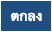
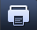
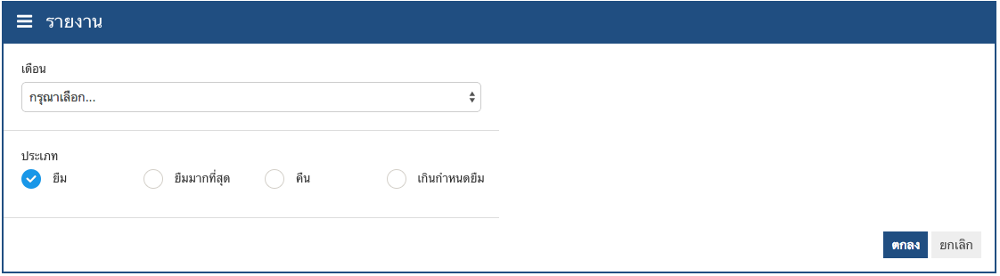
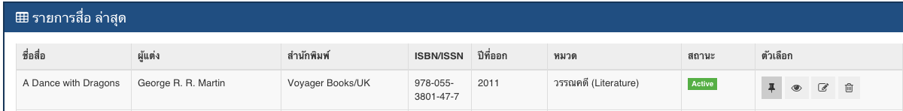
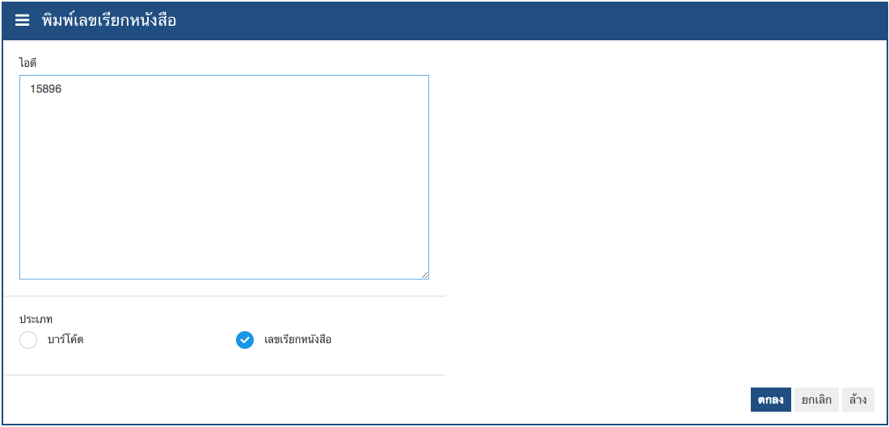

# รายงาน

รายงานแบ่งออกเป็น6ชนิดคดังนี้

|รายการ    | รายละเอียด|
|--------- | ------------|
|ยืม        |รายงานการยืมประจำเดือนของห้องสมุด|
|ยืมมากที่สุด  |รายงานการยืมมากที่สุดประจำเดือนของห้องสมุด|
|คืน        |รายงานการคืนประจำเดือนของห้องสมุด|
|เกินกำหนดยืม|รายงานการเกินกำหนดยืมประจำเดือนของห้องสมุด|
|พิมพ์บาร์โค้ด|พิมพ์ข้อมูลบาร์โค้ดเพื่อไปติดที่สื่อ|
|พิมพ์เลขเรียกหนังสือ|พิมพ์ข้อมูลเลขเรียกหนังสือเพื่อไปติดที่สื่อ|

## วิธีการสั่งพิมพ์รายงานการ ยืม, ยืมมากที่สุด, คืน และเกินกำหนดยืม สามารถทำได้ดังนี้

1. คลิกที่เมนูรายงานซึ่งอยู่ด้านบนของหน้าจอ
2. เลือกเมนูที่ต้องการ
3. เลือกข้อมูลเดือนที่ต้องการ
4. เลือกประเภทของรายงานเป็น
5. หากต้องการแสดงตัวอย่างรายงาน กดปุ่มตกลง หากไม่ต้องการให้กดปุ่มยกเลิก
6. กดปุ่มพิมพ์(รูปปริ๊นเตอร์) เพื่อสั่งพิมพ์รายงาน

## วิธีการสั่งพิมพ์บาร์โค้ด และพิมพ์เลขเรียกหนังสือ สามารถทำได้ดังนี้

1. กดปุ่มเพิ่มรายการสื่อที่ต้องการ ที่หน้ารายการสื่อ ช่องตัวเลือก

2. คลิกที่เมนูรายงานซึ่งอยู่ด้านบนของหน้าจอ
3. เลือกเมนูที่ต้องการ
4. หากต้องการแสดงตัวอย่างรายงาน กดปุ่มตกลง หากไม่ต้องการให้กดปุ่มยกเลิก หากต้องการคืนค่าเดิมให้กดปุ่มล้าง
5. กดปุ่มพิมพ์(รูปปริ๊นเตอร์) เพื่อสั่งพิมพ์รายงาน

