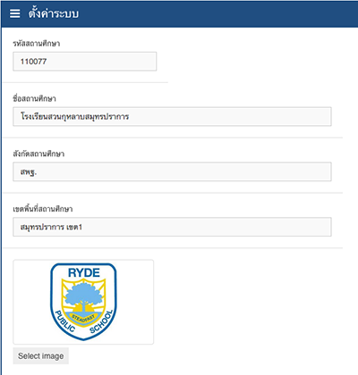

# การตั้งค่า 

## การตั้งค่าระบบ
การตั้งค่าระบบ แบ่งย่อยออกเป็น 3 ส่วนคือ การตั้งค่าพื้นฐาน, การตั้งค่าสถานศึกษา และ การตั้งค่ากฎระเบียบ

### การตั้งค่าพื้นฐาน
คลิกที่เมนูตั้งค่าที่อยู่ด้านบนของหน้าจอ เลือกเมนูระบบ จากนั้นเลือกแถบพื้นฐาน สามารถตั้งค่าข้อมูลได้ดังนี้

  

อนุญาติให้ยืม คือ จำนวนวันที่อนุญาติให้สมาชิกยืมสื่อต่างๆ หากเกินกำหนดจะต้องเสียค่าปรับ
การปรับเงินหากยืมเกินกำหนด คือ กำหนดว่าว่าจะคิดค่าปรับหรือไม่ปรับ หากสมาชิกยืมเกินกำหนด 
ค่าปรับเกินกำหนด คือ จำนวนเงินค่าปรับหากยืมเกินกำหนด
เมื่อแก้ไขข้อมูลเสร็จแล้ว ก็กดปุ่มบันทึก หากต้องการคืนค่าเดิมให้กดปุ่มยกเลิก

### การตั้งค่าสถานศึกษา
คลิกที่เมนูตั้งค่าที่อยู่ด้านบนของหน้าจอ เลือกเมนูระบบ จากนั้นเลือกแถบสถานศึกษา สามารถตั้งค่าข้อมูลได้ดังนี้  

  

|รายการ         | รายละเอียด|
|------------   | -------------|
|รหัสสถานศึกษา    | รหัสสถานศึกษาที่เป็นตัวเลข เช่น 110077|
|ชื่อสถานศึกษา     | ชื่อของสถานศึกษาเช่น โรงเรียนสวนกุหลาบสมุทรปราการ|
|สังกัดสถานศึกษา   | ชื่อสังกัดของสถานศึกษา เช่น สำนักงานคณะกรรมการการศึกษาขั้นพื้นฐาน|
|เขตพื้นที่สถานศึกษา | ชื่อเขตพื้นที่ของสถานศึกษา เช่น สมุทรปราการ เขต1|
|โลโก้สถานศึกษา   | ตราสัญลักษณ์ของสถานศึกษา|

โลโก้สถานศึกษา สามารถเลือกรูปที่ต้องการ โดยกดSelect Image
เมื่อแก้ไขข้อมูลเสร็จแล้ว ก็กดปุ่มบันทึก หากต้องการคืนค่าเดิมให้กดปุ่มยกเลิก

### การตั้งค่ากฎระเบียบ
คลิกที่เมนูตั้งค่าที่อยู่ด้านบนของหน้าจอ เลือกเมนูระบบ จากนั้นเลือกแถบกฎระเบียบ  

  

สามารถตั้งค่าข้อมูลกฎระเบียบต่างๆของห้องสมุด เพื่อให้สมาชิกดู เมื่อแก้ไขข้อมูลเสร็จแล้ว ก็กดปุ่มบันทึก หากต้องการคืนค่าเดิมให้กดปุ่มยกเลิก

## การตั้งค่าปีการศึกษา
คลิกที่เมนูตั้งค่าที่อยู่ด้านบนของหน้าจอ เลือกเมนูปีการศึกษา
จะปรากฎตารางข้อมูลปีการศึกษามีข้อมูลดังนี้  

  

|รายการ          | รายละเอียด|
|------------    | -------------|
|ชื่อปีการศึกษา      | ชื่อปีการศึกษา เช่น 2557|
|ภาคเรียน         | ชื่อของภาคเรียน เช่น 1|
|วันเริ่มต้นปีการศึกษา | วันเริ่มต้นปีการศึกษา เช่น 2014-06-17|
|วันสิ้นสุดปีการศึกษา  | วันสิ้นสุดปีการศึกษา เช่น 2015-03-13|

 
โดยสามารถเรียกดูข้อมูลในหน้าถัดไปได้จากเครื่องมือการนำทางหน้าที่มุมขวาล่าง

### เพิ่มข้อมูลปีการศึกษา 
ให้กดที่ปุ่มสร้างข้อมูลปีการศึกษา อยู่ทางด้านขวาบน
จากนั้น กรอกข้อมูลลงในฟอร์มให้ครบทุกช่อง แล้วก็ปุ่มบันทึก

### แก้ไขข้อมูลปีการศึกษา 
ให้กดปุ่มแก้ไขในช่องตัวเลือก
จากนั้นแก้ไขข้อมูลในฟอร์มตามต้องการ แล้วก็ปุ่มบันทึก

### ลบข้อมูลปีการศึกษา 
ให้กดปุ่มลบในช่องตัวเลือก หลังจากนั้นจะมีกล่องข้อความเตือนขึ้นมา เพื่อยืนยันการลบข้อมูล หากแน่ใจให้กดปุ่มใช่ หากต้องการยกเลิกให้กดปุ่มไม่ใช่

## การตั้งค่าประเภทของสื่อ
คลิกที่เมนูตั้งค่าที่อยู่ด้านบนของหน้าจอ เลือกเมนูประเภทจะปรากฎตารางข้อมูลประเภทมีข้อมูลดังนี้ 

|รายการ    | รายละเอียด|
|-----     | -------------|
|รหัส       | รหัสข้อมูลในฐานข้อมูล|
|รหัสประเภท | ข้อมูลรหัสของประเภท  เช่น น.|
|ชื่อประเภท  | ข้อมูลชื่อของประเภท เช่น หนังสือนวนิยาย|

  
โดยสามารถเรียกดูข้อมูลในหน้าถัดไปได้จากเครื่องมือการนำทางหน้าที่มุมขวาล่าง

### เพิ่มข้อมูลประเภท 
ให้กดที่ปุ่มสร้างข้อมูลประเภท อยู่ทางด้านขวาบน
จากนั้น กรอกข้อมูลลงในฟอร์มให้ครบทุกช่อง แล้วก็ปุ่มบันทึก

### แก้ไขข้อมูลประเภท 
ให้กดปุ่มแก้ไขในช่องตัวเลือก
จากนั้นแก้ไขข้อมูลในฟอร์มตามต้องการ แล้วก็ปุ่มบันทึก

### ลบข้อมูลประเภท 
ให้กดปุ่มลบในช่องตัวเลือก หลังจากนั้นจะมีกล่องข้อความเตือนขึ้นมา เพื่อยืนยันการลบข้อมูล หากแน่ใจให้กดปุ่มใช่ หากต้องการยกเลิกให้กดปุ่มไม่ใช่

## การตั้งค่ากลุ่ม
คลิกที่เมนูตั้งค่าที่อยู่ด้านบนของหน้าจอ เลือกเมนูประเภทจะปรากฎตารางข้อมูลกลุ่มมีข้อมูลดังนี้ 

|รายการ | รายละเอียด|
|-----  | -------------|
|รหัส    | รหัสข้อมูลในฐานข้อมูล|
|รหัสกลุ่ม | ข้อมูลรหัสของกลุ่ม  เช่น น.|
|ชื่อกลุ่ม  | ข้อมูลชื่อของกลุ่ม เช่น หนังสือนวนิยาย|

โดยสามารถเรียกดูข้อมูลในหน้าถัดไปได้จากเครื่องมือการนำทางหน้าที่มุมขวาล่าง

### เพิ่มข้อมูลกลุ่ม 
ให้กดที่ปุ่มสร้างข้อมูลกลุ่ม อยู่ทางด้านขวาบน
จากนั้น กรอกข้อมูลลงในฟอร์มให้ครบทุกช่อง แล้วก็ปุ่มบันทึก

### แก้ไขข้อมูลกลุ่ม 
ให้กดปุ่มแก้ไขในช่องตัวเลือก
จากนั้นแก้ไขข้อมูลในฟอร์มตามต้องการ แล้วก็ปุ่มบันทึก

### ลบข้อมูลกลุ่ม 
ให้กดปุ่มลบในช่องตัวเลือก หลังจากนั้นจะมีกล่องข้อความเตือนขึ้นมา เพื่อยืนยันการลบข้อมูล หากแน่ใจให้กดปุ่มใช่ หากต้องการยกเลิกให้กดปุ่มไม่ใช่

## การตั้งค่าหมวดหมู่
คลิกที่เมนูตั้งค่าที่อยู่ด้านบนของหน้าจอ เลือกเมนูหมวดหมู่จะปรากฎตารางข้อมูลหมวดหมู่มีข้อมูลดังนี้ 

|รายการ    | รายละเอียด|
|-----     | -------------|
|รหัส       | รหัสข้อมูลในฐานข้อมูล|
|ประเภท    | ข้อมูลชื่อของประเภท เช่น หนังสือทั่วไป|
|รหัสหมวดหมู่ | ข้อมูลรหัสของหมวดหมู่  เช่น 000|
|ชื่อหมวดหมู่  | ข้อมูลชื่อของหมวดหมู่ เช่น เบ็ตเตล็ดหรือความรู้ทั่วไป (Generalities)|

โดยสามารถเรียกดูข้อมูลในหน้าถัดไปได้จากเครื่องมือการนำทางหน้าที่มุมขวาล่าง

### เพิ่มข้อมูลหมวดหมู่ 
ให้กดที่ปุ่มสร้างข้อมูลหมวดหมู่ อยู่ทางด้านขวาบน
จากนั้น กรอกข้อมูลลงในฟอร์มให้ครบทุกช่อง แล้วก็ปุ่มบันทึก

### แก้ไขข้อมูลหมวดหมู่ 
ให้กดปุ่มแก้ไขในช่องตัวเลือก
จากนั้นแก้ไขข้อมูลในฟอร์มตามต้องการ แล้วก็ปุ่มบันทึก

### ลบข้อมูลหมวดหมู่
ให้กดปุ่มลบในช่องตัวเลือก หลังจากนั้นจะมีกล่องข้อความเตือนขึ้นมา เพื่อยืนยันการลบข้อมูล หากแน่ใจให้กดปุ่มใช่ หากต้องการยกเลิกให้กดปุ่มไม่ใช่

## การตั้งค่าหมวดหมู่ย่อย
คลิกที่เมนูตั้งค่าที่อยู่ด้านบนของหน้าจอ เลือกเมนูหมวดหมู่จะปรากฎตารางข้อมูลหมวดหมู่ย่อยมีข้อมูลดังนี้ 

|รายการ       | รายละเอียด|
|-----        | -------------|
|รหัส          | รหัสข้อมูลในฐานข้อมูล|
|ประเภท       | ข้อมูลชื่อของประเภท เช่น หนังสือทั่วไป|
|หมวดหมู่       | ข้อมูลชื่อของหมวดหมู่ เช่น เบ็ตเตล็ดหรือความรู้ทั่วไป (Generalities)|
|รหัสหมวดหมู่ย่อย | ข้อมูลรหัสของหมวดหมู่ย่อย  เช่น 000|
|ชื่อหมวดหมู่ย่อย  | ข้อมูลชื่อของหมวดหมู่ย่อย เช่น คอมพิวเตอร์ ความรู้ทั่วไป|

โดยสามารถเรียกดูข้อมูลในหน้าถัดไปได้จากเครื่องมือการนำทางหน้าที่มุมขวาล่าง

### เพิ่มข้อมูลหมวดหมู่ย่อย
ให้กดที่ปุ่มสร้างข้อมูลหมวดหมู่ย่อย อยู่ทางด้านขวาบน
จากนั้น กรอกข้อมูลลงในฟอร์มให้ครบทุกช่อง แล้วก็ปุ่มบันทึก

### แก้ไขข้อมูลหมวดหมู่ย่อย
ให้กดปุ่มแก้ไขในช่องตัวเลือก
จากนั้นแก้ไขข้อมูลในฟอร์มตามต้องการ แล้วก็ปุ่มบันทึก

### ลบข้อมูลหมวดหมู่ย่อย
ให้กดปุ่มลบในช่องตัวเลือก หลังจากนั้นจะมีกล่องข้อความเตือนขึ้นมา เพื่อยืนยันการลบข้อมูล หากแน่ใจให้กดปุ่มใช่ หากต้องการยกเลิกให้กดปุ่มไม่ใช่