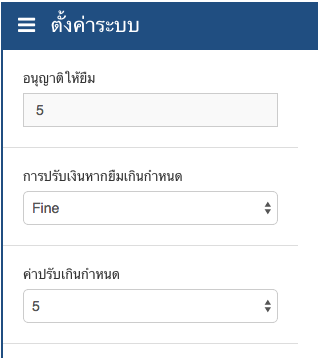

#การตั้งค่า 
การตั้งค่าในระบบ Super Library จะแบ่งออกเป็น 6 ประเภทคือ

รายการ         | รายละเอียด
------------   | -------------
ระบบ | พื้นฐาน, สถานศึกษา และกฎระเบียบของระบบห้องสมุด
ปีการศึกษา | ตั้งค่าปีการศึกษาของสถานศึกษา
ประเภทสื่อ | ตั้งค่าประเภทของสื่อในระบบห้องสมุด
กลุ่มสื่อ | ตั้งค่ากลุ่มของสื่อในระบบห้องสมุด
หมวดหมู่สื่อ | ตั้งค่าหมวดหมู่ของสื่อในระบบห้องสมุด
หมวดหมู่ย่อยสื่อ | ตั้งค่าหมวดหมู่ย่อยของสื่อในระบบห้องสมุด

##พื้นฐาน
คลิกที่เมนูตั้งค่าที่อยู่ด้านบนของหน้าจอ เลือกเมนูระบบ จากนั้นเลือกแถบพื้นฐาน สามารถตั้งค่าข้อมูลได้ดังนี้

รายการ         | รายละเอียด
------------   | -------------
อนุญาติให้ยืม | จำนวนวันที่อนุญาติให้สมาชิกยืมสื่อต่างๆ หากเกินกำหนดจะต้องเสียค่าปรับ
การปรับเงินหากยืมเกินกำหนด | กำหนดว่าว่าจะคิดค่าปรับหรือไม่ปรับ หากสมาชิกยืมเกินกำหนด 
ค่าปรับเกินกำหนด | จำนวนเงินค่าปรับหากยืมเกินกำหนด

เมื่อแก้ไขข้อมูลเสร็จแล้ว ก็กดปุ่มบันทึก หากต้องการคืนค่าเดิมให้กดปุ่มยกเลิก

##สถานศึกษา
คลิกที่เมนูตั้งค่าที่อยู่ด้านบนของหน้าจอ เลือกเมนูระบบ จากนั้นเลือกแถบสถานศึกษา สามารถตั้งค่าข้อมูลได้ดังนี้

รายการ         | รายละเอียด
------------   | -------------
รหัสสถานศึกษา    | รหัสสถานศึกษาที่เป็นตัวเลข เช่น 110077
ชื่อสถานศึกษา     | ชื่อของสถานศึกษาเช่น โรงเรียนสวนกุหลาบสมุทรปราการ
สังกัดสถานศึกษา   | ชื่อสังกัดของสถานศึกษา เช่น สำนักงานคณะกรรมการการศึกษาขั้นพื้นฐาน
เขตพื้นที่สถานศึกษา | ชื่อเขตพื้นที่ของสถานศึกษา เช่น สมุทรปราการ เขต1
โลโก้สถานศึกษา   | ตราสัญลักษณ์ของสถานศึกษา

โลโก้สถานศึกษา สามารถเลือกรูปที่ต้องการ โดยกดSelect Image
เมื่อแก้ไขข้อมูลเสร็จแล้ว ก็กดปุ่มบันทึก หากต้องการคืนค่าเดิมให้กดปุ่มยกเลิก

##กฎระเบียบ
คลิกที่เมนูตั้งค่าที่อยู่ด้านบนของหน้าจอ เลือกเมนูระบบ จากนั้นเลือกแถบกฎระเบียบ 

สามารถตั้งค่าข้อมูลกฎระเบียบต่างๆของห้องสมุด เพื่อให้สมาชิกดู เมื่อแก้ไขข้อมูลเสร็จแล้ว ก็กดปุ่มบันทึก หากต้องการคืนค่าเดิมให้กดปุ่มยกเลิก

##ปีการศึกษา
คลิกที่เมนูตั้งค่าที่อยู่ด้านบนของหน้าจอ เลือกเมนูปีการศึกษา
จะปรากฎตารางข้อมูลปีการศึกษามีข้อมูลดังนี้ 

รายการ          | รายละเอียด
------------    | -------------
ชื่อปีการศึกษา      | ชื่อปีการศึกษา เช่น 2557
ภาคเรียน         | ชื่อของภาคเรียน เช่น 1
วันเริ่มต้นปีการศึกษา | วันเริ่มต้นปีการศึกษา เช่น 2014-06-17
วันสิ้นสุดปีการศึกษา  | วันสิ้นสุดปีการศึกษา เช่น 2015-03-13

###เพิ่มข้อมูลปีการศึกษา 
ให้กดที่ปุ่มสร้างข้อมูลปีการศึกษา อยู่ทางด้านขวาบน
จากนั้น กรอกข้อมูลลงในฟอร์มให้ครบทุกช่อง แล้วก็ปุ่มบันทึก

###แก้ไขข้อมูลปีการศึกษา 
ให้กดปุ่มแก้ไขในช่องตัวเลือก
จากนั้นแก้ไขข้อมูลในฟอร์มตามต้องการ แล้วก็ปุ่มบันทึก

###ลบข้อมูลปีการศึกษา 
ให้กดปุ่มลบในช่องตัวเลือก หลังจากนั้นจะมีกล่องข้อความเตือนขึ้นมา เพื่อยืนยันการลบข้อมูล หากแน่ใจให้กดปุ่มใช่ หากต้องการยกเลิกให้กดปุ่มไม่ใช่

##ประเภทสื่อ
คลิ๊กที่เมนูตั้งค่าที่อยู่ด้านบนของหน้าจอ เลือกเมนูประเภทจะปรากฎตารางข้อมูลประเภทสื่อมีข้อมูลดังนี้ 

รายการ    | รายละเอียด
-----     | -------------
รหัส       | รหัสข้อมูลในฐานข้อมูล
รหัสประเภทสื่อ | ข้อมูลรหัสของประเภทสื่อ  เช่น น.
ชื่อประเภทสื่อ  | ข้อมูลชื่อของประเภทสื่อ เช่น หนังสือนวนิยาย

###เพิ่มข้อมูลประเภทสื่อ 
ให้กดที่ปุ่มสร้างข้อมูลประเภท อยู่ทางด้านขวาบน
จากนั้น กรอกข้อมูลลงในฟอร์มให้ครบทุกช่อง แล้วก็ปุ่มบันทึก

###แก้ไขข้อมูลประเภทสื่อ
ให้กดปุ่มแก้ไขในช่องตัวเลือก
จากนั้นแก้ไขข้อมูลในฟอร์มตามต้องการ แล้วก็ปุ่มบันทึก

###ลบข้อมูลประเภทสื่อ 
ให้กดปุ่มลบในช่องตัวเลือก หลังจากนั้นจะมีกล่องข้อความเตือนขึ้นมา เพื่อยืนยันการลบข้อมูล หากแน่ใจให้กดปุ่มใช่ หากต้องการยกเลิกให้กดปุ่มไม่ใช่

##กลุ่มสื่อ
คลิกที่เมนูตั้งค่าที่อยู่ด้านบนของหน้าจอ เลือกเมนูประเภทจะปรากฎตารางข้อมูลกลุ่มมีข้อมูลดังนี้ 

รายการ | รายละเอียด
-----  | -------------
รหัส    | รหัสข้อมูลในฐานข้อมูล
รหัสกลุ่ม | ข้อมูลรหัสของกลุ่ม  เช่น น.
ชื่อกลุ่ม  | ข้อมูลชื่อของกลุ่ม เช่น หนังสือนวนิยาย

###เพิ่มข้อมูลกลุ่มสื่อ 
ให้กดที่ปุ่มสร้างข้อมูลกลุ่มสื่อ อยู่ทางด้านขวาบน
จากนั้น กรอกข้อมูลลงในฟอร์มให้ครบทุกช่อง แล้วก็ปุ่มบันทึก

###แก้ไขข้อมูลกลุ่มสื่อ
ให้กดปุ่มแก้ไขในช่องตัวเลือก
จากนั้นแก้ไขข้อมูลในฟอร์มตามต้องการ แล้วก็ปุ่มบันทึก

###ลบข้อมูลกลุ่มสื่อ 
ให้กดปุ่มลบในช่องตัวเลือก หลังจากนั้นจะมีกล่องข้อความเตือนขึ้นมา เพื่อยืนยันการลบข้อมูล หากแน่ใจให้กดปุ่มใช่ หากต้องการยกเลิกให้กดปุ่มไม่ใช่

##หมวดหมู่สื่อ
คลิกที่เมนูตั้งค่าที่อยู่ด้านบนของหน้าจอ เลือกเมนูหมวดหมู่จะปรากฎตารางข้อมูลหมวดหมู่มีข้อมูลดังนี้ 

รายการ    | รายละเอียด
-----     | -------------
รหัส       | รหัสข้อมูลในฐานข้อมูล
ประเภทสื่อ    | ข้อมูลชื่อของประเภทสื่อ เช่น หนังสือทั่วไป
รหัสหมวดหมู่สื่อ | ข้อมูลรหัสของหมวดหมู่สื่อ  เช่น 000
ชื่อหมวดหมู่สื่อ  | ข้อมูลชื่อของหมวดหมู่สื่อ เช่น เบ็ตเตล็ดหรือความรู้ทั่วไป (Generalities)

###เพิ่มข้อมูลหมวดหมู่สื่อ
ให้กดที่ปุ่มสร้างข้อมูลหมวดหมู่สื่อ อยู่ทางด้านขวาบน
จากนั้น กรอกข้อมูลลงในฟอร์มให้ครบทุกช่อง แล้วก็ปุ่มบันทึก

###แก้ไขข้อมูลหมวดหมู่สื่อ
ให้กดปุ่มแก้ไขในช่องตัวเลือก
จากนั้นแก้ไขข้อมูลในฟอร์มตามต้องการ แล้วก็ปุ่มบันทึก

###ลบข้อมูลหมวดหมู่สื่อ
ให้กดปุ่มลบในช่องตัวเลือก หลังจากนั้นจะมีกล่องข้อความเตือนขึ้นมา เพื่อยืนยันการลบข้อมูล หากแน่ใจให้กดปุ่มใช่ หากต้องการยกเลิกให้กดปุ่มไม่ใช่

##หมวดหมู่ย่อยสื่อ
คลิกที่เมนูตั้งค่าที่อยู่ด้านบนของหน้าจอ เลือกเมนูหมวดหมู่จะปรากฎตารางข้อมูลหมวดหมู่ย่อยสื่อมีข้อมูลดังนี้ 

รายการ       | รายละเอียด
-----        | -------------
รหัส          | รหัสข้อมูลในฐานข้อมูล
ประเภทสื่อ       | ข้อมูลชื่อของประเภทสื่อ เช่น หนังสือทั่วไป
หมวดหมู่สื่อ       | ข้อมูลชื่อของหมวดหมู่สื่อ เช่น เบ็ตเตล็ดหรือความรู้ทั่วไป (Generalities)
รหัสหมวดหมู่ย่อยสื่อ | ข้อมูลรหัสของหมวดหมู่ย่อยสื่อ  เช่น 000
ชื่อหมวดหมู่ย่อยสื่อ  | ข้อมูลชื่อของหมวดหมู่ย่อยสื่อ เช่น คอมพิวเตอร์ ความรู้ทั่วไป

###เพิ่มข้อมูลหมวดหมู่ย่อยสื่อ
ให้กดที่ปุ่มสร้างข้อมูลหมวดหมู่ย่อย อยู่ทางด้านขวาบน
จากนั้น กรอกข้อมูลลงในฟอร์มให้ครบทุกช่อง แล้วก็ปุ่มบันทึก

###แก้ไขข้อมูลหมวดหมู่ย่อยสื่อ
ให้กดปุ่มแก้ไขในช่องตัวเลือก
จากนั้นแก้ไขข้อมูลในฟอร์มตามต้องการ แล้วก็ปุ่มบันทึก

###ลบข้อมูลหมวดหมู่ย่อยสื่อ
ให้กดปุ่มลบในช่องตัวเลือก หลังจากนั้นจะมีกล่องข้อความเตือนขึ้นมา เพื่อยืนยันการลบข้อมูล หากแน่ใจให้กดปุ่มใช่ หากต้องการยกเลิกให้กดปุ่มไม่ใช่