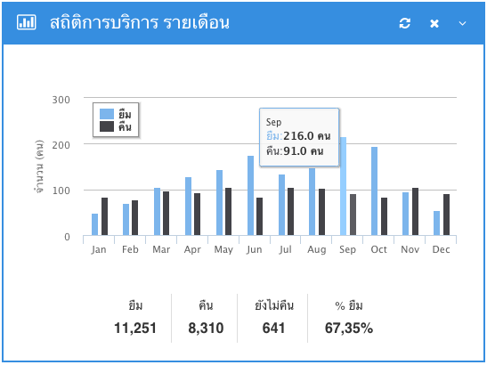
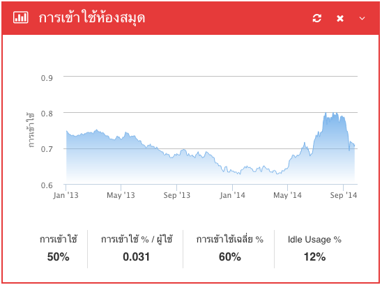
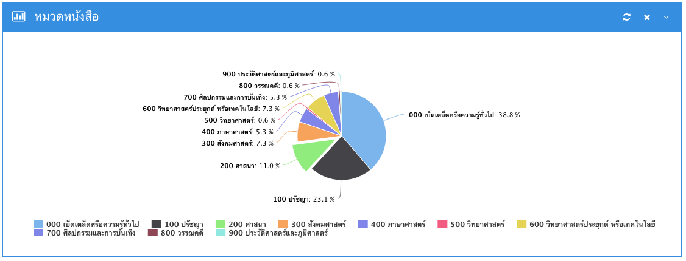
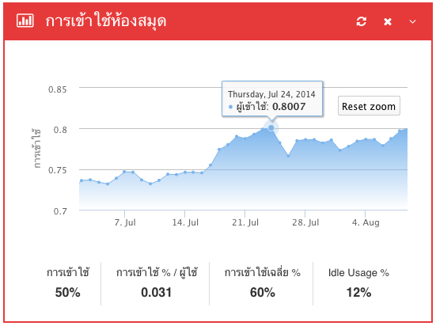
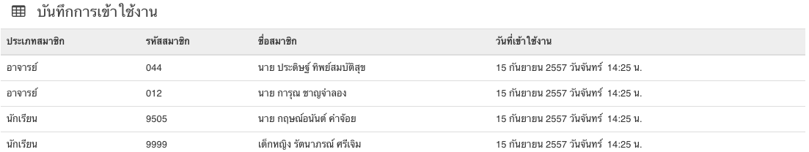

#สถิติ

สถิติแบ่งออกเป็น3เมนูคือ

1. สรุป
2. การเข้าใช้งาน
3. บันทึกการเข้าใช้งาน

##สรุป

1. สถิติการบริการรายเดือน คือ กราฟแบบแท่ง แสดงข้อมูลสถิติการให้บริการยืมคืน หากนำเม้าส์ไปชี้ที่แท่งกราฟ จะแสดงข้อมูลจำนวนการยืมและคืนของสมาชิกประจำเดือนนั้น

2
. สถิติการเข้าใช้ห้องสมุด คือ แสดงสถิติการเข้าใช้งานห้องสมุดของสมาชิก เป็นกราฟแบบเส้น  โดยนำข้อมูลจากการบันทึกการเข้าใช้งานระบบห้องสมุดทั้งหมด สามารถซูมดูสถิติรายวันได้ โดยการคลิ๊กเม้าส์ค้างไว้แล้วลากจากจุดเริ่มต้นไปยังจุดสิ้นสุดแล้วปล่อย

3. สถิติการยืมแบ่งโดยหมวด คือ กราฟวงกลมแสดงข้อมูลสถิติการยืมเป็นเปอร์เซ็นต์แบ่งตามหมวดหมู่ 

##การเข้าใช้งาน

1. คลิกที่เมนูสถิติซึ่งอยู่ด้านบนของหน้าจอ
2. เลือกเมนูการเข้าใช้งาน

แสดงสถิติการเข้าใช้งานห้องสมุดของสมาชิก เป็นกราฟแบบเส้น  โดยนำข้อมูลจากการบันทึกการเข้าใช้งานระบบห้องสมุดทั้งหมด
สามารถซูมดูสถิติรายวันได้ โดยการคลิ๊กเม้าส์ค้างไว้แล้วลากจากจุดเริ่มต้นไปยังจุดสิ้นสุดแล้วปล่อย

##บันทึกการเข้าใช้งาน

1. คลิกที่เมนูสถิติซึ่งอยู่ด้านบนของหน้าจอ
2. เลือกเมนูบันทึกการเข้าใช้งาน
3. กรอกรหัสสมาขิก หรือใช้เครื่องสแกนบาร์โค้ดสแกนจากบัตรนักเรียน ที่ช่องแบบฟอร์มบักทึกการใช้งาน
4. กดปุ่มบักทึก

เมื่อบันทึกการใช้งานเรียบร้อยแล้ว ข้อมูลการเข้าใช้งานของสมาชิกที่เพิ่งบันทึก จะปรากฎอยู่ในตารางบันทึกการเข้าใช้งานด้านล่างของฟอร์ม มีข้อมูลดังนี้

1. ประเภทสมาชิก
2. รหัสสมาชิก
3. ชื่อสมาชิก
4. วันที่เข้าใช้งาน

